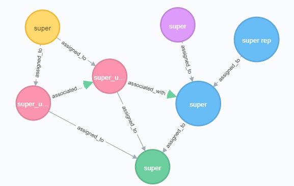

# REST API

## What is the Purpose of the API?
The Policy Machine REST API exposes a standard set of administrative NGAC commands.  This API also acts as a Policy Enforcement Point (PEP) by ensuring any calling user has permission to carry out a command before any action is taken. Exposing the PEP allows users to create web-based, NGAC aware applications.

## Important Notes

1. **Super user metadata** - There are 7 nodes that make up the super user metadata. The super user is assigned to 2 User Attributes super_ua1 and super_ua2. These two attributes are assigned to a Policy Class also called super.  Super_ua1 is associated with an Object Attribute, super_oa1, which is also assigned to the Policy Class super, with * permissions.  This gives any user in super_ua1 all permissions on objects in super_oa1. There is one Object called super assigned to super_oa1. Super_ua2 is associated with super_ua1 with * permissions.  This allows the super user to have all permissions on itself as well.

2. **Creating a Policy Class** - When creating a Policy Class we check if the requesting user has the permission "create a Policy Class" on the super object.
3. **Policy Class assignments** - When a Policy Class is created, an Object Attribute that will represent the Policy Class is also created, and assigned to super_oa1.  The representative will be used any time a user is assigning to or deassigning from the Policy Class.  This allows us to control who can perform these actions since Policy Classes them selves cannot be assigned or associated to any other nodes.


## Getting Started
### Run Docker Compose

1. Build the war file by running `mvn clean package install` from the project root. This will create `pm.war` in the project's `/target/` directory.
2. Run `docker-compose up` from the project root to start the docker container.

### Docker Compose File
```yaml
version: '3'
services:
  neo4j:
    image: neo4j:latest
    volumes:
      - $HOME/neo4j/data:/data
      - $HOME/neo4j/logs:/logs
    ports:
      - 7474:7474
      - 7687:7687
  pm:
    image: tomcat:8-jre8
    volumes:
      - ./target/pm.war:/usr/local/tomcat/webapps/pm.war
    ports:
      - 8080:8080
    links:
      - neo4j
```
The Compose file creates two linked containers.  

1. A Neo4j container which is where we will store our access control policy data. We expose the ports 7474 and 7687 to interact with the Neo4j database.
2. The tomcat server that will deploy `pm.war`.

### Tested Operating Systems

1. macOS
    - [Docker for Mac](https://hub.docker.com/editions/community/docker-ce-desktop-mac)
2. Windows 7
    - [Docker Toolbox](https://docs.docker.com/toolbox/toolbox_install_windows)
    - **Note**: Docker Toolbox is legacy software and handles volumes differently than Docker for Windows/Mac.  There is one line in the Docker Compose file that needs to be updated.
	      - Create a shared folder in Oracle VirtualBox called `/target/` which points to the target folder of the PM project.
        - change this line in the Compose file:
	    `./target/pm.war:/usr/local/tomcat/webapps/pm.war`
	    to
	    `//target/pm.war:/usr/local/tomcat/webapps/pm.war`

### Connecting to a Database
Upon starting the server for the first time, you must provide the database connection details to your desired database. Navigate to `/pm/config.jsp`, choose either Neo4j or Mysql and provide the connection parameters.  Once the connection is set, the details will be saved locally on the server and used anytime the server restarts.

#### Notes on Neo4j
If using docker-compose to run the Policy Machine server, the web application will recognize the neo4j service by the name `neo4j`.  Therefore, when setting the connection to the database, the host name should be `neo4j`.  Also, the bolt protocol is used so the port should be `7687`.

#### Notes on MySQL
The MySQL schema can be found at `pmsql.sql`.

## How to Use the API

### Requests
The exposed web services act as an administrative Policy Enforcement Point (PEP).  When a request comes in the PEP forwards the request to the PDP, which ensures the requesting user is allowed to carry out the action. This means the PEP always needs to know which user is sending a request.  This is tracked using session IDs that represent users who have authenticated successfully with the server.  Every endpoint requires this session ID to determine the user.  The only API that does not require a session ID is the Sessions API.  This API is used to authenticate users and provides the session IDs that will be used in subsequent requests to the Policy Machine.

For example, to sign in as the super user:
```
POST /pm/api/sessions
Content-Type:application/json
{
  "username": "super",
  "password": "super"
}
```
The response from the server will look like:
```json
{
  "code": 9000,
  "message": "success",
  "entity": "NEW_SESSION_ID"
}
```
Now the user can pass this session ID to the server for any other calls to the API.

### Responses
A response from the Policy Machine will always return an HTTP status code of 200, with more details provided in the body of the response.  For example:
```json
{
  "code": 9000,
  "message": "success",
  "entity": "return value of the API call"
}
```
### Response codes


## Sessions API

### Create session
Authenticate the provided credentials and return a session ID if successfully authenticated.
###### Endpoint
`POST /pm/api/sessions`
###### Parameters
Parameter | Required | Location| Description
---|---|---|---
username | required | body | The username of the user
password | required | body | The password of the user

###### Example request
```curl
$ curl -X POST {host}:{port}/pm/api/sessions
```
###### Example request body
```json
{
  "username": "super",
  "password": "super"
}
```

###### Example response
```json
{
  "code": 9000,
  "message": "success",
  "entity": "{sessionID}"
}
```
---
### Delete session
Delete the session with the given session ID.
###### Endpoint
`DELETE /pm/api/sessions/{sessionID}`
###### Example request
```curl
$ curl -X DELETE {host}:{port}/pm/api/sessions/{sessionID}
```
###### Example response
```json
{
  "code": 9000,
  "message": "session deleted",
  "entity": "null"
}
```
---
### Get session user
Get the ID of the user that corresponds with the provided session ID.
###### Endpoint
`GET /pm/api/sessions/{sessionID}`
###### Example request
```curl
$ curl {host}:{port}/pm/api/sessions/{sessionID}
```
###### Example response
```json
{
  "code": 9000,
  "message": "success",
  "entity": 1234
}
```
---
## Graph API

### Get nodes
Retrieve nodes from the graph. Use query parameters to filter nodes based on name, type, or any other properties nodes may have. The returned set of nodes will only contain those the user, identified by the session parameter, has access to.

###### Endpoint
`GET /pm/api/graph/nodes`
###### Parameters
Parameter | Required | Location | Description
---|---|---|---
session | true | query | The ID of the current session.
name | false | query | The name of the nodes to search for.
type | false | query | The type of the nodes to search for.

**Important Notes**

1. The **name** and **type** query parameters are the only preset parameters to search for.  It is possible to search for nodes with any property key value pair by including the pair in the query parameters of the request. For example, `?key1=value1&key2=value2`.
2. Only nodes that match every provided property will be returned.
3. To search for all nodes that have a specfic property key but an arbitrary value use the wildcard `*`. For example,  `key3=*`.

###### Example request
```curl
$ curl {host}:{port}/pm/api/graph/nodes?session={sessionID}&type=OA
```
###### Example response
```json
{
  "code": 9000,
  "message": "success",
  "entity": [
    {
    "name": "node1",
    "type": "OA",
    "properties": {
      "key1": "value1"
      }
    },
    {
    "name": "node2",
    "type": "OA",
    "properties": {
      "key2": "value2"
      }
    }
  ]
}
```

### Create node
Create a new node in the NGAC graph with the provided name, type, and properties. When creating a Policy Class, leave the baseID parameter empty, as it will be ignored.  For all other node type, a base ID is required in order to connect the node to the graph and ensure the calling user (identified by the provided session ID) has the permission to create a node in the base node (check that the user can assign to the base node).

###### Endpoint
`POST /pm/api/graph/nodes`
###### Parameters
Parameter | Required | Location | Description
---|---|---|---
session | true | query | The ID of the current session.
parentID | false | body | The ID of the node to assign the new node to.
name | true | body | The name of the node.
type | true | body | The type of the node.
properties | true | body | A map of properties to give the node.

###### Example request
```curl
$ curl -X POST {host}:{port}/pm/api/graph/nodes?session={sessionID}
```
###### Example request body
```json
{
  "name": "newNode",
  "type": "OA",
  "properties": {
  "key1": "value1",
  "key2": "value2"
  }
}
```
###### Example response
```json
{
  "code": 9000,
  "message": "success",
  "entity": 12345
}
```

### Get node
Retrieve the information for a node identified by the given ID.

###### Endpoint
`GET /pm/api/graph/nodes/{nodeID}`
###### Parameters
Parameter | Required | Location | Description
---|---|---|---
session | true | query | The ID of the current session.
nodeID | true | path | The ID of the node to retrieve.

###### Example request
```curl
$ curl {host}:{port}/pm/api/graph/nodes/12345678?session={sessionID}
```
###### Example response
```json
{
  "code": 9000,
  "message": "success",
  "entity": {
  "id": 12345678,
  "name": "newNode",
  "type": "OA",
  "properties": {
    "key1": "value1",
    "key2": "value2"
    }
  }
}
```

### Update node
Update the name and/or properties of a node with the given ID. The properties provided in the parameters will overwrite existing properties.

###### Endpoint
`UPDATE /pm/api/graph/nodes/{nodeID}`
###### Parameters
Parameter | Required | Location | Description
---|---|---|---
session | true | query | The ID of the current session.
nodeID | true | path | The ID of the node to update.
name | false | body | The updated name.
properties | false | body | The properties to override the existing properties of the node.

###### Example request
```curl
$ curl -X PUT {host}:{port}/pm/api/graph/nodes/12345?session={sessionID}
```
###### Example request body
```json
{
  "name": "updated_name",
  "properties": {
    "key3": "value3"
  }
}
```
###### Example response
```json
{
  "code": 9000,
  "message": "node updated",
  "entity": null
}
```

### Delete node
Delete the node with the given ID.  The calling user must have permission to delete the node in order for the action to successfully be carried out.

###### Endpoint
`DELETE /pm/api/graph/nodes/{nodeID}`
###### Parameters
Parameter | Required | Location | Description
---|---|---|---
session | true | query | The ID of the current session.
nodeID | true | path | The ID of the node to delete.

###### Example request
```curl
$ curl -X DELETE {host}:{port}/pm/api/graph/nodes/12345?session={sessionID}
```
###### Example response
```json
{
  "code": 9000,
  "message": "node deleted",
  "entity": null
}
```

### Get node children
Get the nodes that are assigned to the node with the given ID.  The method will return only the children the calling user has access to.

###### Endpoint
`GET /pm/api/graph/nodes/{nodeID}/children`
###### Parameters
Parameter | Required | Location | Description
---|---|---|---
session | true | query | The ID of the current session.
nodeID | true | path | The ID of the node to get the children of.

###### Example request
```curl
$ curl {host}:{port}/pm/api/graph/nodes/{nodeID}/children?session={sessionID}
```
###### Example response
```json
{
  "code": 9000,
  "message": "success",
  "entity": [
    {
    "name": "child1",
    "type": "OA",
    "properties": {
      "key1": "value1"
      }
    },
    {
    "name": "child2",
    "type": "OA",
    "properties": {
      "key2": "value2"
      }
    }
  ]
}
```

### Get node parents
Get the nodes that a node is assigned to.  Only the parents that the calling user has access to will be returned.
###### Endpoint
`GET /pm/api/graph/nodes/{nodeID}/parents`
###### Parameters
Parameter | Required | Location | Description
---|---|---|---
session | true | query | The ID of the current session.
nodeID | true | path | The ID of the node to get the parents of.

###### Example request
```curl
$ curl {host}:{port}/pm/api/graph/nodes/1234/parents?session={sessionID}
```
###### Example response
```json
{
  "code": 9000,
  "message": "success",
  "entity": [
    {
    "name": "parent1",
    "type": "OA",
    "properties": {
      "key1": "value1"
      }
    },
    {
    "name": "parent2",
    "type": "OA",
    "properties": {
      "key2": "value2"
      }
    }
  ]
}
```

### Create assignment
Create an assignment between two nodes.  An assignment must not already exist between the nodes, and the types of the nodes must make a valid assignment.

child | parent
---|---
PC |
OA | OA, PC
UA | UA, PC
O | OA
u | UA

###### Endpoint
`POST /pm/api/graph/{child}/assignments/{parent}`
###### Parameters
Parameter | Required | Location | Description
---|---|---|---
session | true | query | The ID of the current session. |
child | true | path | The ID of the child node and a matrix parameter for the type.
parent | true | path | The ID of the parent node and a matrix parameter for the type.

###### Example request
```curl
$ curl -X POST {host}:{port}/pm/api/graph/child;id=1234;type=OA/assignments/parent;id=4321;type=OA?session={sessionID}
```

###### Example response
```json
{
  "code": 9000,
  "message": "assignment created",
  "entity": null
}
```

### Delete assignment
Delete an assignment between two nodes, as long as the calling user has permissions to do so. If an assignment does not exist between the two nodes, nothing will happen and a success code will be returned.
###### Endpoint
`DELETE /pm/api/graph/{childID}/assignments/{parentID}`
###### Parameters
Parameter | Required | Location | Description
---|---|---|---
session | true | query | The ID of the current session.
child | true | body | The ID of the child node and a martix parameter for the type.
parent | true | body | The ID of the parent node and a matrix parameter for the type.

###### Example request
```curl
$ curl -X DELETE {host}:{port}/pm/api/graph/child;id=1234;type=OA/assignments/parent;id=4321;type=OA?session={sessionID}
```
###### Example response
```json
{
  "code": 9000,
  "message": "assignment deleted",
  "entity": null
}
```

### Get associations
Get the associations the given node is apart of.  The node must exist in the graph. The query parameter `type` is required and denotes which type of associations to retrieve for the node.  Accepted values are `source` and `target`. Source will get the associations the given node is the source of.  Target will get the associations the given node is a target of.
###### Endpoint
`GET /pm/api/graph/{nodeID}/associations`
###### Parameters
Parameter | Required | Location | Description
---|---|---|---
session | true | query | The ID of the current session.
nodeID | true | path | The ID of the node to get the associations for.
type | true | query | Either `source` or `target`.  

###### Example request
```curl
$ curl {host}:{port}/pm/api/graph/101?session={sessionID}&type=source
```
###### Example response
```json
{
  "1234": [
  "read",
  "write"
  ],
  "4321": [
  "read"
  ]
}
```

### Create association
Create an association between a user attribute and a target node.  The user attribute and target nodes need to already exist in the graph. The target node can be another user attribute or an object attribute. The target segment of the request url must contain the ID and type of the intended target node.
###### Endpoint
`POST /pm/api/graph/{uaID}/associations/{target}`
###### Parameters
Parameter | Required | Location | Description
---|---|---|---
session | true | query | The ID of the current session.
uaID | true | path | The ID of the User Attribute.
target | true | path | The target of the association.  The ID and Type are **required** matrix parameters.
operations | false | body | The set of operations to give the association.

###### Example request
```curl
$ curl {host}:{port}/pm/api/graph/1234/associations/target;id=4321;type=OA?session={sessionID}
```
###### Example request body
```json
{
  "operations": [
    "read",
    "write"
  ]
}
```
###### Example response
```json
{
  "code": 9000,
  "message": "association created",
  "entity": null
}
```

### Update association
Update an association between a user attribute and a target node. The existing operations will be overwritten by the operations provided in the request.
If an association does not exist between the two nodes, one will be created.
###### Endpoint
`PUT /pm/api/graph/{uaID}/associations/{target}`
###### Parameters
Parameter | Required | Location | Description
---|---|---|---
session | true | query | The ID of the current session.
uaID | true | path | The ID of the User Attribute.
target | true | path | The target of the association.  The ID and Type are **required** matrix parameters.
operations | false | body | The set of operations to give the association.

###### Example request
```curl
$ curl -X PUT {host}:{port}/pm/api/graph/1234/associations/target;id=4321;type=OA?session={sessionID}
```
###### Example request body
```json
{
  "operations": [
    "read"
  ]
}
```
###### Example response
```json
{
  "code": 9000,
  "message": "association updated",
  "entity": null
}
```

### Delete association
Delete an association between two nodes. If one does not exist, nothing will happen, and a success code will be returned.
###### Endpoint
`DELETE /pm/api/graph/{uaID}/associations/{target}`
###### Parameters
Parameter | Required | Location | Description
---|---|---|---
session | true | query | The ID of the current session.
uaID | true | path | The ID of the User Attribute.
target | true | path | The target of the association.  The ID and Type are **required** matrix parameters.

###### Example request
```curl
$ curl -X DELETE {host}:{port}/pm/api/graph/1234/associations/target;id=4321;type=OA?session={sessionID}
```
###### Example response
```json
{
  "code": 9000,
  "message": "association deleted",
  "entity": null
}
```
