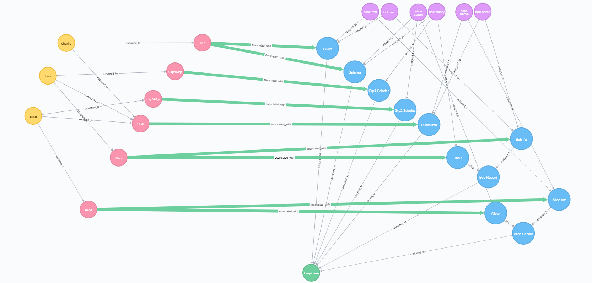

# Examples

## Standalone Examples
Below are examples on how to create a NGAC graph and query that graph for access control decisions using the Policy Machine as a Java library.

### Bank Teller

The full code for this example can be found at `src/gov/nist/csd/pm/demos/standalone/BankTellerExample.java`

**Example configuration summary:**

- Users: u1, u2
- An object o1
- Two policy classes: RBAC and Branches
    - RBAC
        - o1 is assigned to accounts
        - u1 is a Teller that has read and write permissions on accounts
        - u2 is an Auditor that has read permissions on accounts
    - Branches
        - u1 and u2 are both assigned to the Branch 1 user attribute
        - o1 is assigned to the Branch 1 object attribute
        - the Branch 1 user attribute has read and write permissions on the Branch 1 object attribute

**Access control state:**

- u1 can read and write o1
- u2 can read o1
---

```
// 1. Create a new Graph instance.  For this example, we'll use the `MemGraph` which is an in memory implementation of the Graph interface.
Graph graph = new MemGraph();

// 2. Create the user nodes `u1` and `u2`.
long user1ID = graph.createNode(new NodeContext(rand.nextLong(), "u1", U, null));
long user2ID = graph.createNode(new NodeContext(rand.nextLong(), "u2", U, null));


// 3. Create the object, `o1` that will be the target of the access queries.
long objectID = graph.createNode(new NodeContext(rand.nextLong(), "o1", O, null));


// 4. Create the `RBAC` policy class node.
long rbacID = graph.createNode(new NodeContext(rand.nextLong(), "RBAC", PC, null));


// 5. Create an object attribute for the `Accounts`.
long accountsID = graph.createNode(new NodeContext(rand.nextLong(), "Accounts", OA, null));


// 6. Create the `Teller` and `Auditor` user attributes.
long tellerID = graph.createNode(new NodeContext(rand.nextLong(), "Teller", UA, null));
long auditorID = graph.createNode(new NodeContext(rand.nextLong(), "Auditor", UA, null));


// 7. Assign the `Accounts` object attribute to the `RBAC` policy class node.
graph.assign(new NodeContext(accountsID, OA), new NodeContext(rbacID, PC));


// 8. Assign the object, `o1`, to the `Accounts` object attribute.
graph.assign(new NodeContext(objectID, O), new NodeContext(accountsID, OA));


// 9. Assign `u1` to the `Teller` user attribute and `u2` to the `Auditor` user attribute.
graph.assign(new NodeContext(user1ID, U), new NodeContext(tellerID, UA));
graph.assign(new NodeContext(user2ID, U), new NodeContext(auditorID, UA));


// 10. Create the associations for `Teller` and `Auditor` on `Account` in RBAC. `Teller` has read and write permissions, while `Auditor` just has read permissions.
graph.associate(new NodeContext(tellerID, UA), new NodeContext(accountsID, OA), new HashSet<>(Arrays.asList("r", "w")));
graph.associate(new NodeContext(auditorID, UA), new NodeContext(accountsID, OA), new HashSet<>(Arrays.asList("r")));


// 11. Create the `Branches` policy class.
long branchesID = graph.createNode(new NodeContext(rand.nextLong(), "branches", PC, null));


// 12. Create an object attribute for `Branch 1`.
long branches1OAID = graph.createNode(new NodeContext(rand.nextLong(), "branch 1", OA, null));


// 13. Create the `Branch 1` user attribute
long branches1UAID = graph.createNode(new NodeContext(rand.nextLong(), "branch 1", UA, null));


// 14. Assign the object, `o1`, to the `Branch 1` object attribute
graph.assign(new NodeContext(objectID, O), new NodeContext(branches1OAID, OA));


// 15. Assign the users, `u1` and `u2`, to the branch 1 user attribute
graph.assign(new NodeContext(user1ID, U), new NodeContext(branches1UAID, UA));
graph.assign(new NodeContext(user2ID, U), new NodeContext(branches1UAID, UA));


// 16. Create an association between the `branch 1` user attribute and the `branch 1` object attribute.
//This will give both users read and write on `o1` under the `branches` policy class.
graph.associate(new NodeContext(branches1UAID, UA), new NodeContext(branches1OAID, OA), new HashSet<>(Arrays.asList("r", "w")));


// 17. Test the configuration using the `PReviewDecider` implementation of the `Decider` interface.
//The constructor for a `PReviewDecider` receives the graph we created and a list of prohibitions.
//Since no prohibitions are used in this example, we'll pass null.
Decider decider = new PReviewDecider(graph, null);


// 18. Check that `u1` has read and write permissions on `o1`.
HashSet<String> permissions = decider.listPermissions(user1ID, 0, objectID);
assertTrue(permissions.contains("r"));
assertTrue(permissions.contains("w"));


// 19. Check that `u1` has read permissions on `o1`.
permissions = decider.listPermissions(user2ID, 0, objectID);
assertTrue(permissions.contains("r"));
```

Below is a visual representation of the graph created in the bank teller example.
[](images/bankteller.png)


### Employee Record


**Example configuration summary:**

- Users: bob, alice, charlie
- The objects are bob's and alice's name, salary, and ssn.
- All users are assigned to the Staff user attribute
- The Staff user attribute has read permissions on Public Info, which in this case is names.
- Charlie has the HR attribute
- HR has read and write permissions on Salaries and SSNs
- Bob and Alice have the Grp1Mgr and Grp2Mgr attributes, respectively
- Grp1Mgr and Grp2Mgr have read permissions on Grp1Salaries and Grp2Salaries, respectively
- Bob and Alice have read and write permissions on their name and ssn, and read permissions on their salaries.   

**Access control state:**

- Alice can read and write her name and SSN, and read her salary, and the salaries of those in Group 2.
- Bob can read and write his name and SSN, and read his salary, and salaries of those in Group 1.
- Charlie can read and write all salaries and SSNs, and read all names.

```
Graph graph = new MemGraph();

// create nodes
// object attributes
long salariesID = graph.createNode(new NodeContext(rand.nextLong(), "Salaries", OA, null));
long ssnsID = graph.createNode(new NodeContext(rand.nextLong(), "SSNs", OA, null));
long grp1SalariesID = graph.createNode(new NodeContext(rand.nextLong(), "Grp1 Salaries", OA, null));
long grp2SalariesID = graph.createNode(new NodeContext(rand.nextLong(), "Grp2 Salaries", OA, null));
long publicID = graph.createNode(new NodeContext(rand.nextLong(), "Public Info", OA, null));

long bobRecID = graph.createNode(new NodeContext(rand.nextLong(), "Bob Record", OA, null));
long bobRID = graph.createNode(new NodeContext(rand.nextLong(), "Bob r", OA, null));
long bobRWID = graph.createNode(new NodeContext(rand.nextLong(), "Bob r/w", OA, null));

long aliceRecID = graph.createNode(new NodeContext(rand.nextLong(), "Alice Record", OA, null));
long aliceRID = graph.createNode(new NodeContext(rand.nextLong(), "Alice r", OA, null));
long aliceRWID = graph.createNode(new NodeContext(rand.nextLong(), "Alice r/w", OA, null));

// objects for bob's name, salary, and ssn
long bobNameID = graph.createNode(new NodeContext(rand.nextLong(), "bob name", O, null));
long bobSalaryID = graph.createNode(new NodeContext(rand.nextLong(), "bob salary", O, null));
long bobSSNID = graph.createNode(new NodeContext(rand.nextLong(), "bob ssn", O, null));

// objects for alice's name, salary, and ssn
long aliceNameID = graph.createNode(new NodeContext(rand.nextLong(), "alice name", O, null));
long aliceSalaryID = graph.createNode(new NodeContext(rand.nextLong(), "alice salary", O, null));
long aliceSSNID = graph.createNode(new NodeContext(rand.nextLong(), "alice ssn", O, null));

// user attributes
long hrID = graph.createNode(new NodeContext(rand.nextLong(), "HR", UA, null));
long grp1MgrID = graph.createNode(new NodeContext(rand.nextLong(), "Grp1Mgr", UA, null));
long grp2MgrID = graph.createNode(new NodeContext(rand.nextLong(), "Grp2Mgr", UA, null));
long staffID = graph.createNode(new NodeContext(rand.nextLong(), "Staff", UA, null));
long bobUAID = graph.createNode(new NodeContext(rand.nextLong(), "Bob", UA, null));
long aliceUAID = graph.createNode(new NodeContext(rand.nextLong(), "Alice", UA, null));

// users
long bobID = graph.createNode(new NodeContext(rand.nextLong(), "bob", U, null));
long aliceID = graph.createNode(new NodeContext(rand.nextLong(), "alice", U, null));
long charlieID = graph.createNode(new NodeContext(rand.nextLong(), "charlie", U, null));

// policy class
long pcID = graph.createNode(new NodeContext(rand.nextLong(), "Employee Records", PC, null));


// assignments
// assign users to user attributes
graph.assign(new NodeContext(charlieID, U), new NodeContext(hrID, UA));
graph.assign(new NodeContext(bobID, U), new NodeContext(grp1MgrID, UA));
graph.assign(new NodeContext(aliceID, U), new NodeContext(grp2MgrID, UA));
graph.assign(new NodeContext(charlieID, U), new NodeContext(staffID, UA));
graph.assign(new NodeContext(bobID, U), new NodeContext(staffID, UA));
graph.assign(new NodeContext(aliceID, U), new NodeContext(staffID, UA));
graph.assign(new NodeContext(bobID, U), new NodeContext(bobUAID, UA));
graph.assign(new NodeContext(aliceID, U), new NodeContext(aliceUAID, UA));

// assign objects to object attributes
// salary objects
graph.assign(new NodeContext(bobSalaryID, O), new NodeContext(salariesID, OA));
graph.assign(new NodeContext(bobSalaryID, O), new NodeContext(grp1SalariesID, OA));
graph.assign(new NodeContext(bobSalaryID, O), new NodeContext(bobRID, OA));

graph.assign(new NodeContext(aliceSalaryID, O), new NodeContext(salariesID, OA));
graph.assign(new NodeContext(aliceSalaryID, O), new NodeContext(grp2SalariesID, OA));
graph.assign(new NodeContext(aliceSalaryID, O), new NodeContext(aliceRID, OA));

// ssn objects
graph.assign(new NodeContext(bobSSNID, O), new NodeContext(ssnsID, OA));
graph.assign(new NodeContext(bobSSNID, O), new NodeContext(bobRWID, OA));

graph.assign(new NodeContext(aliceSSNID, O), new NodeContext(aliceID, OA));
graph.assign(new NodeContext(aliceSSNID, O), new NodeContext(aliceRWID, OA));

// name objects
graph.assign(new NodeContext(bobNameID, O), new NodeContext(publicID, OA));
graph.assign(new NodeContext(bobNameID, O), new NodeContext(bobRWID, OA));

graph.assign(new NodeContext(aliceNameID, O), new NodeContext(publicID, OA));
graph.assign(new NodeContext(aliceNameID, O), new NodeContext(aliceRWID, OA));

// bob and alice r/w containers to their records
graph.assign(new NodeContext(bobRID, OA), new NodeContext(bobRecID, OA));
graph.assign(new NodeContext(bobRWID, OA), new NodeContext(bobRecID, OA));

graph.assign(new NodeContext(aliceRID, OA), new NodeContext(aliceRecID, OA));
graph.assign(new NodeContext(aliceRWID, OA), new NodeContext(aliceRecID, OA));


// assign object attributes to policy classes
graph.assign(new NodeContext(salariesID, OA), new NodeContext(pcID, PC));
graph.assign(new NodeContext(ssnsID, OA), new NodeContext(pcID, PC));
graph.assign(new NodeContext(grp1SalariesID, OA), new NodeContext(pcID, PC));
graph.assign(new NodeContext(grp2SalariesID, OA), new NodeContext(pcID, PC));
graph.assign(new NodeContext(publicID, OA), new NodeContext(pcID, PC));
graph.assign(new NodeContext(bobRecID, OA), new NodeContext(pcID, PC));
graph.assign(new NodeContext(aliceRecID, OA), new NodeContext(pcID, PC));

// associations
HashSet<String> rw = new HashSet<>(Arrays.asList("r", "w"));
HashSet<String> r = new HashSet<>(Arrays.asList("r"));

graph.associate(new NodeContext(hrID, UA), new NodeContext(salariesID, OA), rw);
graph.associate(new NodeContext(hrID, UA), new NodeContext(ssnsID, OA), rw);
graph.associate(new NodeContext(grp1MgrID, UA), new NodeContext(grp1SalariesID, OA), r);
graph.associate(new NodeContext(grp2MgrID, UA), new NodeContext(grp2SalariesID, OA), r);
graph.associate(new NodeContext(staffID, UA), new NodeContext(publicID, OA), r);
graph.associate(new NodeContext(bobUAID, UA), new NodeContext(bobRWID, OA), rw);
graph.associate(new NodeContext(bobUAID, UA), new NodeContext(bobRID, OA), r);
graph.associate(new NodeContext(aliceUAID, UA), new NodeContext(aliceRWID, OA), rw);
graph.associate(new NodeContext(aliceUAID, UA), new NodeContext(aliceRID, OA), r);

// test configuration
// create a decider
// not using prohibitions in this example, so null is passed
Decider decider = new PReviewDecider(graph, null);

// user: bob
// target: 'bob ssn'
// expected: [r, w]
// actual: [r, w]
HashSet<String> permissions = decider.listPermissions(bobID, 0, bobSSNID);
assertTrue(permissions.contains("r"));
assertTrue(permissions.contains("w"));

// user: bob
// target: 'bob ssn'
// expected: [r]
// actual: [r]
permissions = decider.listPermissions(bobID, 0, bobSalaryID);
assertTrue(permissions.contains("r"));

// user: bob
// target: 'alice ssn'
// expected: []
// actual: []
permissions = decider.listPermissions(bobID, 0, aliceSSNID);
assertTrue(permissions.isEmpty());

// user: bob
// target: 'alice salary'
// expected: []
// actual: []
permissions = decider.listPermissions(bobID, 0, aliceSalaryID);
assertTrue(permissions.isEmpty());

// user: bob
// target: 'bob ssn'
// expected: [r, w]
// actual: [r, w]
permissions = decider.listPermissions(aliceID, 0, aliceSSNID);
assertTrue(permissions.contains("r"));
assertTrue(permissions.contains("w"));

// user: charlie
// target: 'alice salary'
// expected: [r, w]
// actual: [r, w]
permissions = decider.listPermissions(charlieID, 0, aliceSalaryID);
assertTrue(permissions.contains("r"));
assertTrue(permissions.contains("w"));
```
Below is a visual representation of the graph created in the employee record example.
[](images/emprec.png)

## REST API Examples
Coming soon...
