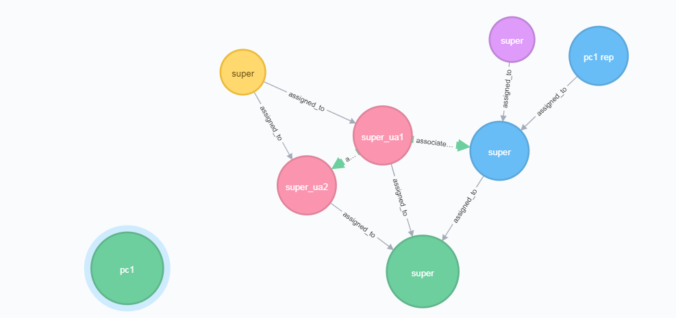

## Getting Started

### Purpose
The Policy Machine REST API exposes a standard set of administrative NGAC commands.  This API also acts as a Policy Enforcement Point (PEP) by ensuring any calling user has permission to carry out a command before any action is taken. Exposing the PEP allows users to create web-based, NGAC aware applications.

### Important Notes

1. **Namespaces** - Node's can belong to namespaces which allow for multiple nodes of the same type to have the same name.  Nodes that have the same name but different type are allowed in the same namesapce. If a node is created with out specifying the namespace, it will be put in the 'default' namespace.
1. **Super user metadata** - There are 7 nodes that make up the super user metadata. The super user is assigned to 2 user attributes super_ua1 and super_ua2. These two attributes are assigned to a policy class also called super.  Super_ua1 is associated with an Object Attribute, super_oa1, which is also assigned to the policy class super, with * permissions.  This gives any user in super_ua1 all permissions on objects in super_oa1. There is one Object called super assigned to super_oa1. Super_ua2 is associated with super_ua1 with * permissions.  This allows the super user to have all permissions on itself as well.

2. **Creating a policy class** - When creating a policy class we check if the requesting user has the permission "create a policy class" on the super object.
3. **Policy class assignments** - When a policy class is created, an Object Attribute that will represent the policy class is also created, and assigned to super_oa1.  The representative will be used any time a user is assigning to or deassigning from the policy class.  This allows us to control who can perform these actions since policy classes them selves cannot be assigned or associated to any other nodes.


### Run with Docker-compose

1. Build the war file by running `mvn clean package install` from the project root. This will create `pm.war` in the project's `/target/` directory.
2. Run `docker-compose up` from the project root to start the docker container.

#### Docker Compose File
```yaml
version: '3'
services:
  neo4j:
    image: neo4j:latest
    volumes:
      - $HOME/neo4j/data:/data
      - $HOME/neo4j/logs:/logs
    ports:
      - 7474:7474
      - 7687:7687
  pm:
    image: tomcat:8-jre8
    volumes:
      - ./target/pm.war:/usr/local/tomcat/webapps/pm.war
    ports:
      - 8080:8080
    links:
      - neo4j
```
The Compose file creates two linked containers.  

1. A Neo4j container which is where we will store our access control policy data. We expose the ports 7474 and 7687 to interact with the Neo4j database.
2. The tomcat server that will deploy `pm.war`.

##### Notes on Neo4j
The web application recognizes the neo4j service by the name `neo4j`.  Therefore, when setting the connection to the database, the host name should be `neo4j`.  Also, the bolt protocol is used so the port should be `7687`.

#### Tested Operating Systems

1. macOS
    - [Docker for Mac](https://hub.docker.com/editions/community/docker-ce-desktop-mac)
2. Windows 7
    - [Docker Toolbox](https://docs.docker.com/toolbox/toolbox_install_windows)
    - **Note**: Docker Toolbox is legacy software and handles volumes differently than Docker for Windows/Mac.  There is one line in the Docker Compose file that needs to be updated.
	      - Create a shared folder in Oracle VirtualBox called `/target/` which points to the target folder of the PM project.
        - change this line in the Compose file:
	    `./target/pm.war:/usr/local/tomcat/webapps/pm.war`
	    to
	    `//target/pm.war:/usr/local/tomcat/webapps/pm.war`

#### Connecting to a Database
Update the database connection parameters in `/resources/db.config`.
